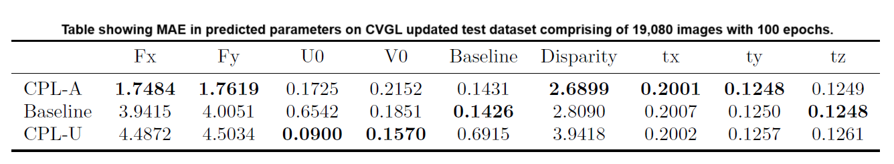

# Camera Calibration through Camera Projection Loss Dataset

For the estimation of camera parameters. We propose an updated CVGL Camera Calibration dataset using CARLA Simulator.

# Code for Multi-task Learning  for Camera Calibration
Code from the Proposed approach in the Paper : https://arxiv.org/pdf/2110.03479.pdf

Source Git Repo : https://github.com/thanif/CPL

- MTL-CPL-A.ipynb 
- MTL-CPL-U.ipynb
- MTL-Baseline.ipynb

# Weights for Camera Calibration through Camera Projection Loss

All weights are available here:  https://drive.google.com/drive/folders/1wYDCMrJVgWAy3lJEGQsakYLUjYDl7i9s?usp=sharing

# Datasets

CVGL Camera Calibration Dataset :
https://drive.google.com/drive/folders/1Zd4FPVq4xNU_MKz-gTxKtjj2axgH3IQ6?usp=drive_link

Cityscapes Dataset (Real Dataset): https://www.cityscapes-dataset.com

Cityscapes Dataset format used for experiments:
https://drive.google.com/drive/folders/1Pe1nHpUe6PPtMpQpum-oKuD4v_aYXdfc?usp=drive_link

# About CVGL Camera Calibration Dataset

The dataset has been collected using the CARLA Simulator gear server available here: https://drive.google.com/file/d/1X52PXqT0phEi5WEWAISAQYZs-Ivx4VoE/view

The data collector used is available here: https://github.com/carla-simulator/data-collector

The dataset consists of 50 camera configurations with each town having 25 configurations. The parameters modified for generating the configurations include fov, x, y, z, pitch, yaw, and roll. Here, fov is the field of view, (x, y, z) is the translation while (pitch, yaw, and roll) is the rotation between the cameras. The total number of image pairs is 63,600, out of which 38,000 belong to Town 3 while 25,600 belong to Town 5, the difference in the number of images is due to the length of the tracks.

Focal Length is computed as follows: img_size[0]/(2 * np.tan(fov * np.pi/360))

U0 and V0 are computed as: img_size[0]/2

Fx = WINDOW_WIDTH/(2 * tan(fov * pi/360))

Fy = WINDOW_HEIGHT/(2 * tan(fov * pi/360))

Baseline is computed as: sqrt(x^2 + y^2 + z^2)

Disparity value is computed using the following:

stereo = cv2.StereoBM_create(numDisparities=16, blockSize=15)

disparity_map = stereo.compute(l_im, r_im)

disparity_value = np.mean(disparity_map)

xcam, ycam, zcam are computed as follows:

xcam = (Fx * x) / disparity_value
 
ycam = - (xcam / Fx) * (5 - U0)
                
zcam = (xcam / Fy) * (V0 - 5)

xworld, yworld, zworld are computed as follows:

yworld = ycam + y

xworld = xcam * cos(pitch) + zcam * sin(pitch) + x

zworld = - xcam * sin(pitch) + zcam * cos(pitch) + z

Left Camera was  constant with the following configuration:

X = 0.2

Y = 0

Z = 0.2

Pitch = -1

Right Camera Configurations:

FOV with range from 50 to 110

X with range from 0.2 to 1

Y with range from 0.2 to 0.7

Z with range from 0.2 to 0.7

Pitch with range from -30 to 30

While making the dataset, we used the values as the difference between left and right camera. e.g. the value for X for first episode is 0.

# Results from Camera Calibration through Camera Projection Loss on this dataset.

     

     

